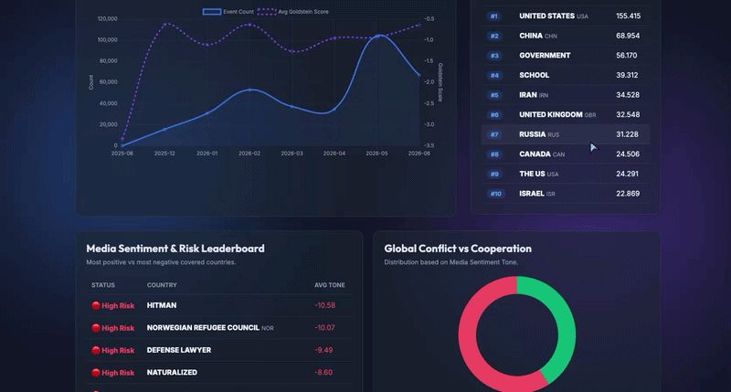

<div align="center">
  
  
  
  
  <br />
  <h1>🌍 Aegis Intelligence</h1>
  <p><b>(formerly Global-Intelligence-Dashboard)</b></p>
  <p><b>Real-Time Geopolitical Streaming & Graph Analytics Engine</b></p>
</div>



Aegis Intelligence is a distributed, full-stack intelligence platform that ingests real-time geopolitical event data from [GDELT](https://www.gdeltproject.org/), models it as a global interaction network in Neo4j, and provides real-time stream processing, graph machine learning, and advanced 3D geospatial visualizations.

Built as an advanced portfolio project, Aegis Intelligence transforms millions of raw global events into actionable diplomatic and conflict insights.

---

## ✨ Advanced Features

### 📡 Real-Time Stream Processing (Apache Kafka)
- Continuously ingests 15-minute live updates from GDELT via a custom Python Producer.
- Streams live geopolitical events through Kafka into a persistent Python Consumer thread.
- Broadcasts breaking news directly to the browser via **WebSockets**. (The frontend maintains a true persistent WebSocket connection with the API webhook, updating the UI genuinely without `setInterval` polling).

### 🧠 Graph Machine Learning (Neo4j GDS)
- **Geopolitical Bloc Detection:** Implements the **Louvain Modularity Algorithm** to algorithmically detect global communities and alliances based on interaction frequency, dynamically color-coding the network graph.
- **Influence Ranking:** Runs **PageRank** continuously to determine the most influential global actors (Governments, Organizations, Rebels) in the current geopolitical climate.

### 🚨 Live Anomaly Detection
- The streaming consumer calculates the 30-day historical average sentiment (Goldstein Scale) for interacting dyadic actors.
- If a sudden, extreme drop in sentiment occurs (e.g., severe conflict breaking a peaceful baseline), the system flags it as an **Anomaly**, triggering flashing red alerts in the UI feed.

### 🗺️ Event Trajectory Mapping (Geospatial Analytics)
- A stunning **3D Interactive WebGL Globe**.
- Automatically extracts `ActionGeo` coordinate data from the live stream.
- Draws glowing, animated trajectory arcs from the acting country directly to the geographic location of the event in real-time.

---

## 📊 By The Numbers
- **100,000+** diplomatic and economic interactions processed and analyzed per dataset.
- **190+** sovereign entities and thousands of organizations actively tracked.
- **~15** distinct geopolitical blocs algorithmically detected globally via Louvain Modularity, with typical modularity scores of `> 0.45`.
- **2,700+** nodes natively colored and clustered in the frontend network viewer.

---

## 🏛️ Architecture Rationale ("Why Kafka?")
GDELT publishes data in 15-minute batches. While a simple scheduled cron job could technically ingest this data, **Apache Kafka** is used intentionally in this architecture for three core reasons:
1. **Decoupling & Resilience:** The Producer safely dumps the 15-minute batch onto a topic. If Neo4j is overwhelmed or the Consumer crashes during complex anomaly detection, the batch is not lost; it waits in the Kafka queue.
2. **Replay-ability:** Kafka allows us to seamlessly replay historical streams if we want to retrain the machine learning anomaly baselines or backfill a secondary database.
3. **Multi-Consumer Fanout:** The architecture is designed to scale. By using Kafka, we can easily attach a secondary consumer (e.g., ElasticSearch) to ingest the exact same event stream for full-text article search without modifying the ingestion pipeline.

---

## 🛠️ Technology Stack

| Component | Technology |
|---|---|
| **Data Source** | GDELT (Global Database of Events, Language, and Tone) |
| **Stream Ingestion** | Python, Apache Kafka, Zookeeper |
| **Graph Database** | Neo4j, Graph Data Science (GDS) Plugin |
| **Backend API** | FastAPI, Uvicorn, WebSockets |
| **Frontend UI** | Vanilla JS, CSS3, HTML5 |
| **Visualizations** | Three.js / Globe.gl (3D Globe), Vis.js (Networks), Chart.js |
| **Deployment** | Docker Compose |

---

## 🚀 Quick Start Guide

### Prerequisites
1. **Docker & Docker Compose** installed.
2. (Optional) Python 3.11+ if running scripts outside Docker.

### 1. Spin up the Architecture
The entire distributed system (Zookeeper, Kafka, Neo4j, API, Frontend, Producer, Consumer) is orchestrated via Docker.
```bash
docker compose up -d --build
```
*Note: Wait about 30-45 seconds on the first boot for Neo4j and Kafka to fully initialize.*

### 2. Seed the Historical Graph
Run the automated initialization script to project the graphs and seed the database with community blocs (PageRank & Louvain).
```bash
# Make the script executable
chmod +x init_graph.sh

# Run the seeding script
./init_graph.sh
```

### 3. Open the Dashboard
Navigate your browser to:
**[http://localhost:8080](http://localhost:8080)**

Keep the tab open! The live stream updates automatically every 15 minutes as GDELT publishes new batches.

---

## 🏗️ System Architecture Flow

1. **Producer:** Polls GDELT endpoint every 60 seconds. On new ZIP release, downloads, parses, and produces messages to `gdelt-events` Kafka topic.
2. **Consumer:** Listens to Kafka. Ingests events into Neo4j (MERGE nodes/edges). Calculates Anomalies. POSTs event to API internal webhook.
3. **Neo4j:** Stores `Actor` nodes and `ECONOMIC_EVENT` relationships. Runs periodic GDS algorithms.
4. **API:** Serves historical REST endpoints (`/trends`, `/network`) and maintains WebSocket connections with clients.
5. **Frontend:** Subscribes to `/ws/live`, renders WebGL Globe trajectories, Network Community Graphs, and Anomaly alerts.

---

## 🤝 Contributing
Contributions, issues, and feature requests are welcome! Feel free to check the [issues page](#).

## 📄 License
This project is open-sourced under the [MIT License](LICENSE).
# Global-Intelligence-Dashboard
